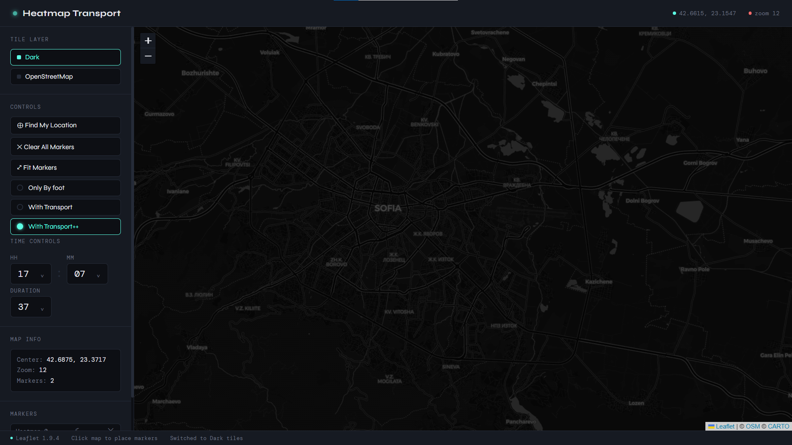
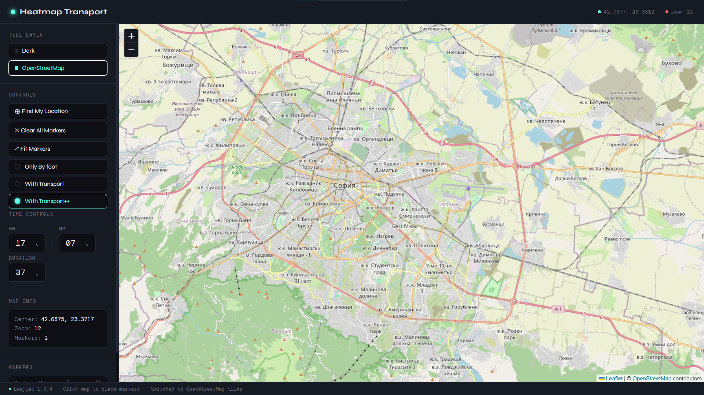
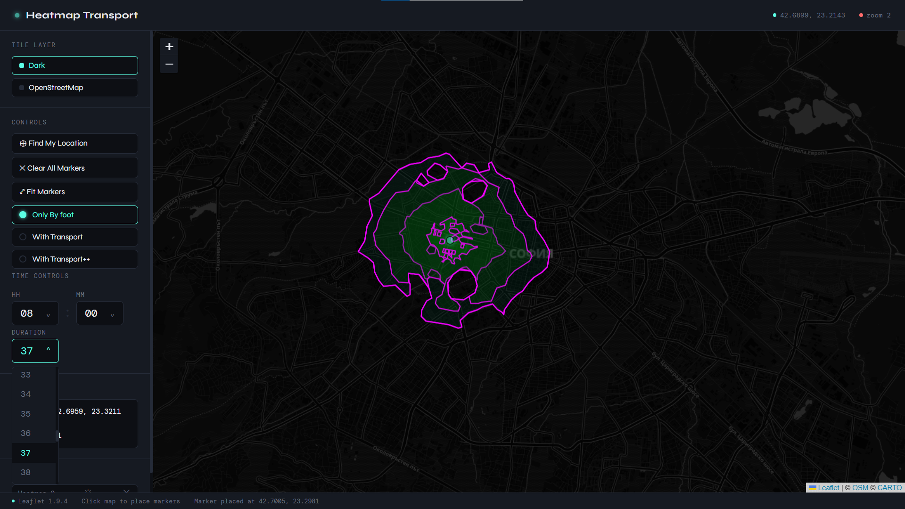
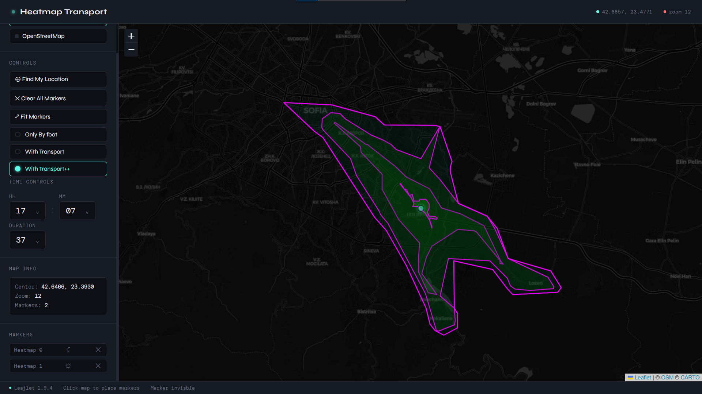
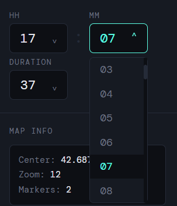
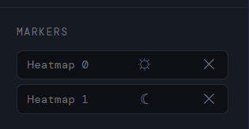

# Heatmap Transport

Generating a heatmap of reachability from a point on a map going only by foot or taking the public tranport in Sofia, Bulgaria. 

## To use

A database is needed with the right setup. For this project, PostgreSQL db was provided by lectors of the course. 
0. Go to the root of the project.
1. Create an .env file for DB access.
2. Run `npm start run` in terminal from the root of the project.
3. Go to `localhost:3000` and try it out.

## Features

- Map can be changed between light and dark mode.

- By clicking on the map, a marker is placed as the start point of a heatmap.
- Heatmap can be changed to use different algorithm:
    - By foot: only uses the pedestrian network.
    - With Transport: alternates between walking and riding a transport from one of its stops to a maximum of 4 switches. Singlethreaded.
    - With Transport++: alternates between walking and riding a transport from one of its stopsto a maximum of 4 switches. Multithreaded with worker-threads.
    *Note: current algorithm always first walks as there isn't a stop selection implemented to be otherwise.*

*Heatmap by foot*

*Heatmap with transport*

- Changing the length of the trip and the start time as trips depend on their schedule.

- Hide and uncover heatmaps from the marker submenu.

## To do

- [ ] Add geometry for the taken trips.
- [ ] Add legend for different colors of the heatmap.
- [ ] Fix indexing in DB.
- [ ] Fix multithreading bottleneck.
- [ ] Better heatmap opacity and coloring.
- [ ] Write a script for db creation.

### Sources

[Public transport system of Sofia](https://urbandata.sofia.bg/dataset/gtfs-static)